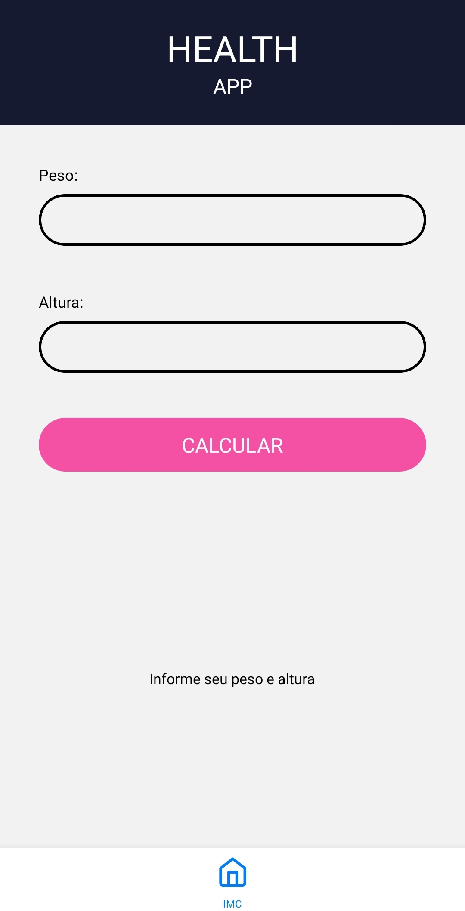

# Health APP
Como já diz o nome, **Health APP** é um APP de saúde feito para aqueles que precisam de cuidados médicos em relação ao seu peso e afins,
nele é possível *calcular IMC*, ver a qualidade da sua alimentação e *calcular gasto médio calórico*.  
**Print da aplicação atualmente:**

    

## Front - End

No front-end está sendo utilizado ReactNative para criar a aplicação mobile.

### Porque ReactNative?

React Native é uma framework fácil e dá portabilidade para buildar tanto em Android como em IOS acabou sendo a escolhida para esse aplicativo, claro que o ReactNative possuí muitos problemas sendo o principal a sua perca de eficiência quando se trata de muitas coisas na tela, porém como estamos criando algo que não demanda tanto recurso gráfico não nos preocupamos com isso.

### Tecnologias